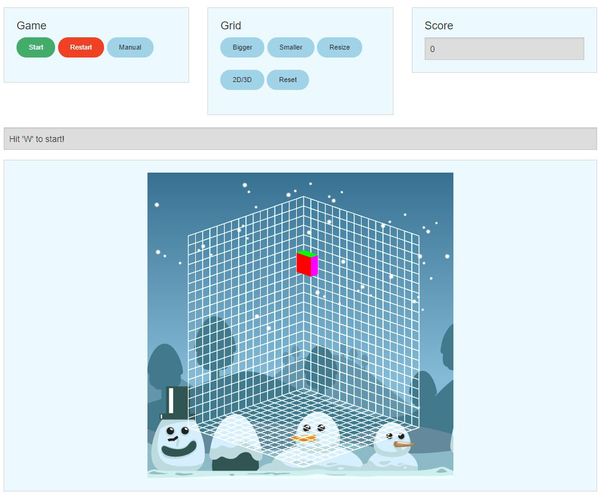

# 3D Tetris Prototyp
Created for University of Vienna 

## Controls
### Movement
`↑`...........move in -Z direction

`↓`............move in Z direction

`←`...........move in -X direction

`→`...........move in X direction

`Space`....release the object

`W`...........start or pause

### Rotation

`x`..............rotate counter-/clockwise around the X-axis

`y`..............rotate counter-/clockwise around the Y-axis

`z`..............rotate counter-/clockwise around the Z-axis

### View
`Mouse`.........change cameraposition - left: translation / right: rotation

`P`.................switch between orthographic and perspective view

`G`.................toggle wireframe.

`R`.................hide the whole wireframe

`Q`.................restore the View/Lock the mouse

`S`.................zoom in/out

### Debug
`I`...................print all informations about the current Object in the console (F12)

`U`.................print the globalGrid in the console (F12)

## Resources
* _WebGL Programming Guide / Kouichi Matsuda, Rodger Lea_
* http://learningwebgl.com/blog/?page_id=1217
* https://developer.mozilla.org/de/docs/Web/JavaScript
* http://webglfundamentals.org/webgl/lessons/webgl-fundamentals.html
* CSS-Framework [Foundation](http://foundation.zurb.com/) for design
* Languages: _Javascript_, _HTML_ and _GLSL ES_

## Architecture

### Spielfeld
* __globalGrid:__ Hierbei handelt es sich um die Matrix-repräsentation des Spielfelds im Hintergrund. Es wird verwendet um die Kollisionsabfrage zu handeln. Wird erstellt in grid.js/resetGrid().
* __drawGrid:__ Dies ist die gezeichnete, visuelle Variante des Grids. Wird erstellt in grid.js/createGrid() sowie createToggleGrid() und gezeichnet in tetris.js/drawScene()

### Tetromions
Die Form, Farbe und der Objektgrid jedes Tetromino wird übersichtlichkeitshalber in einer eigenen Javascript Datei definiert (O.js, S.js,usw.). 
Zusätzlich wird in jeder Tetromino-Datei ein Objekt erstellt, mittels der Funktion tetrominoConstructor() (Tetris.js) und anschließend in das Array tetrominos[] gespeichert. Aufgerufen werden die Dateien einmalig in initBuffer() (Tetris.js). 
Jedes Objekt hat seinen eigenen Namen, Farbwerte, blocks, sowie individuelle positionen im golbalGrid sowie im drawGrid. Gelandete Elemente werden im Array landedElems[] gespeichert und in drawScene() fortlaufend gezeichnet.

### Controls
Die Steuerung wird in keyHandler.js, mittels event-handling realisiert.

### Collision detection
In collisionDetection.js wird im globalGrid auf Kollisionen kontrolliert. checkSpawnPosition() prüft die Startposition und liefert false zurück, wenn sie besetzt ist, was zum gameOver() führt. 
checkGrid() hingegen kontrolliert bei jeder Bewegung den globalGrid. Ist ein Objekt gelandet, so wird die Funktion drawInGrid() aufgerufen, welche den ObjectGrid des Tetrominos in den globalGrid mit '1' speichert.

### Methods
Hier sind alle essentiellen Funktionen implementiert, die für das aktuelle lauffähige Tetris Programm notwendig sind.

* __tetrominoConstructor(name, items,posSize,colSize, blocks, colors, vertexIndices, objectGrid0, objectGrid90, objectGrid180, objectGrid270, startPointGrid, endPointGrid, topleft):__ Erzeuge ein neues Tetromino Objekt.

* __spawn(elem):__ Überwacht, ob ein Element gelandet ist oder nicht. Nicht Gelandet: Zeichne das aktuelle Objekt; Gelandet: Kopiere das aktuelle Element und speichere in landedElems[]

* __gravity():__ Bewege das Objekt in konstanter Geschwindigkeit in -Y Richtung. Speichere gleichzeitig die aktuelle Y-Position des Objekts.
* __transformationAnimation():__ Animiere Roationen und Bewegungen.

* __webGLStart():__ Initialisiert WebGL, den Vertex- und den Fragmentshader, sowie die Buffer fuer die Eckpunkte und Farbwerte, behandelt Tastatureingaben und wiederholt das Programm

* __initGL(canvas):__ Initialisiere WebGL (Web Graphic Libary) und waehlt den Rendering Context WebGL fuer das Canvas Element aus.

* __getShader(gl, id):__ Ruft den korrekten Shadertyp auf und liefert einen Grafikkarten kompatiblen Shader

* __initShaders():__ Fuegt den Vertexshader (zustaendig fuer Berechnung der Eckpunkte des 3DModels) und den Fragmentshader (zustaendig fuer die Oberflaeche des Modells), zu einem WebGL Programm Objekt (ausfuerbar direkt auf der GraKa) zusammen. Jedes Programm besteht aus jeweils einem Vertex- sowie Fragment- oder Pixelshader.

* __setMatrixUniforms():__ Wandle die Matrizen von Javascript auf WebGL (Grafikkarten-seitig) um, damit die Sichtbarkeit fuer die Shaders garantiert ist.

* __degToRad(degrees):__ Umrechnung vom Radiant- zum Grad Winkelmaß

* __mvPushMatrix():__ Speichere die globale mvMatrix (ModelView-) auf einen Stack.

* __mvPopMatrix():__ Lade die letzte Matrix vom Stack.

* __initBuffers():__ Definiere die Objekte mithilfer ihrer Eckpunkte. Fuelle Grafikkarten Buffer mit informationen uber die gewuenschten Objekte.

* __drawScene():__ Zeichnet die Szene inklusive den Objekten und den drawGrid.

* __animate():__ Fuehrt eine Animation aus, wenn der Zielwinkel noch nicht erreicht wurde.

* __tick():__ Aktualisiert das Bild um eine Animation zu erschaffen.

* __START.HTML__
Im Head werden alle Scripts aufgerufen, wobei sich der Code der beiden Shaderscripts (Vertex- und Fragmentshader) direkt in der HTML befindet. Außerdem ist hier natürlich der gesamte HTML Code zum Seitenaufbau enthalten und ruft beim Seitenaufruf sofort die Funktion webGLStart() (in Tetris.js) auf.

* __WEBGL-UTILS.JS__
Liefert das entsprechende unabhängige Refresh-Plugin für den Browser, damit sich dieser Grafik-Änderungen sofort wahrnimmt und darstellt.

* __GLMATRIX-0.9.5.MIN.JS__
Bibliothek die alle mathematischen Matrix operationen beinhaltet.
